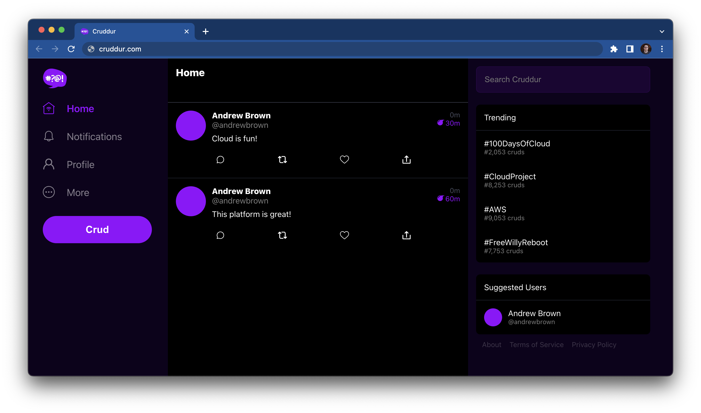

# AWS Cloud Project Bootcamp

- Application: Cruddur
- Cohort: 2023-A1

This is the starting codebase that will be used in the FREE AWS Cloud Project Bootcamp 2023

## Cruddur App

Introducing a new micro-blogging platform that emphasizes privacy and the present moment. 

Our platform allows users to post updates, thoughts, and photos that automatically expire after a period of time, ensuring that your personal information and conversations stay relevant and in the moment. 

Perfect for busy professionals, students and anyone who wants to stay connected without the pressure of maintaining a permanent online presence. 

Sign up now and experience the freedom of ephemeral social media.

## Project Scenario

A startup company has decided to build their own micro-blogging platform and has hired you to be its first cloud engineer. The company paid a web-development firm to translate their wireframe designs into a mock web-application for the purpose of demoing to raise capital.

After a successful round of funding, you [the cloud engineer] have been tasked with taking the mock web-application and making it production ready at scale. 

The startup company consulted a fractional CTO to help choose some of the technical requirements to place the company on a good technical roadmap:

- The frontend application should be written in Javascript using React (functional components).
- The backend application should be written in Python using Flask. Since we plan to be API only
- Since we want to choose a popular framework API only framework
- Since we want a micro-framework because we are offloading as much to the cloud as possible to avoid be a monolithic application
- Since we don’t want an ORM because the CTO considers it an anti-pattern
- Since Python is the most popular language being learned for cloud right now. That an API specification be defined detailing the exact endpoints required.
The web application:
  - Shall be deployed to AWS.
  - Takes advantage of modern-applications cloud services.

The startup company has spent the majority of their funding on hiring you for the next 6 months (but mostly spent the money on marketing and buying a really cool domain) and so you also need to ensure you keep the cloud provider costs as low as possible.

## Journaling Homework

The `/journal` directory contains

- [ ] [Week 0](journal/week0.md)
- [ ] [Week 1](journal/week1.md)
- [ ] [Week 2](journal/week2.md)
- [ ] [Week 3](journal/week3.md)
- [ ] [Week 4](journal/week4.md)
- [ ] [Week 5](journal/week5.md)
- [ ] [Week 6](journal/week6.md)
- [ ] [Week 7](journal/week7.md)
- [ ] [Week 8](journal/week8.md)
- [ ] [Week 9](journal/week9.md)
- [ ] [Week 10](journal/week10.md)
- [ ] [Week 11](journal/week11.md)
- [ ] [Week 12](journal/week12.md)
- [ ] [Week 13](journal/week13.md)