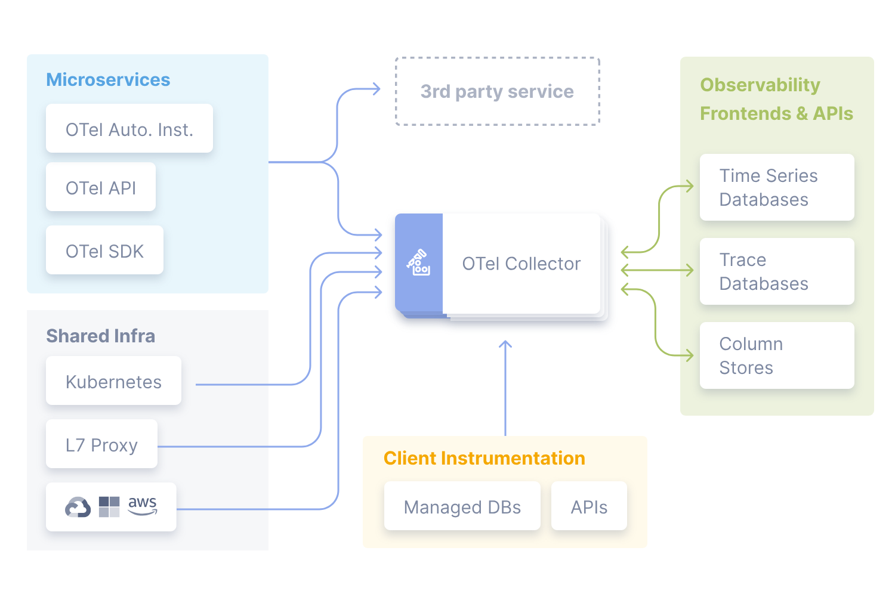
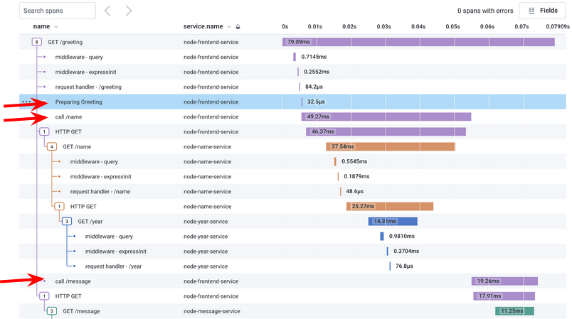

# Week 2 — Distributed Tracing

## What is Distributed Tracing?

Distributed tracing is a method of tracking application requests as they flow from frontend devices to backend services and databases. Developers can use distributed tracing to troubleshoot requests that exhibit high latency or errors.

## What is [HoneyComb](https://www.honeycomb.io/)?

Honeycomb is a fast analysis tool that helps you analyze your code’s performance and behavior to troubleshoot complex relationships within your system to solve problems faster. Honeycomb uses Opentelementry SDK which is then sent to Honeycomb.



Here's an example what we will se after everything's done and working.



When creating a new dataset in Honeycomb it will provide all these installation insturctions
We'll add the following files to our `requirements.txt`

```
opentelemetry-api 
opentelemetry-sdk 
opentelemetry-exporter-otlp-proto-http 
opentelemetry-instrumentation-flask 
opentelemetry-instrumentation-requests
```

We'll install these dependencies:

```sh
pip install -r requirements.txt
```

Add to the `app.py`

```py
from opentelemetry import trace
from opentelemetry.instrumentation.flask import FlaskInstrumentor
from opentelemetry.instrumentation.requests import RequestsInstrumentor
from opentelemetry.exporter.otlp.proto.http.trace_exporter import OTLPSpanExporter
from opentelemetry.sdk.trace import TracerProvider
from opentelemetry.sdk.trace.export import BatchSpanProcessor
```

```py
# Initialize tracing and an exporter that can send data to Honeycomb
provider = TracerProvider()
processor = BatchSpanProcessor(OTLPSpanExporter())
provider.add_span_processor(processor)
trace.set_tracer_provider(provider)
tracer = trace.get_tracer(__name__)
```

```py
# Initialize automatic instrumentation with Flask
app = Flask(__name__)
FlaskInstrumentor().instrument_app(app)
RequestsInstrumentor().instrument()
```

Add teh following Env Vars to `backend-flask` in docker compose

```yml
OTEL_EXPORTER_OTLP_ENDPOINT: "https://api.honeycomb.io"
OTEL_EXPORTER_OTLP_HEADERS: "x-honeycomb-team=${HONEYCOMB_API_KEY}"
OTEL_SERVICE_NAME: "${HONEYCOMB_SERVICE_NAME}"
```

You'll need to grab the API key from your honeycomb account:

```sh
export HONEYCOMB_API_KEY=""
gp env HONEYCOMB_API_KEY=""
```

## CloudWatch Logs

Add to the `requirements.txt`

```
watchtower
```

```sh
pip install -r requirements.txt
```


In `app.py`

```
import watchtower
import logging
from time import strftime
```

```py
# Configuring Logger to Use CloudWatch
LOGGER = logging.getLogger(__name__)
LOGGER.setLevel(logging.DEBUG)
console_handler = logging.StreamHandler()
cw_handler = watchtower.CloudWatchLogHandler(log_group='cruddur')
LOGGER.addHandler(console_handler)
LOGGER.addHandler(cw_handler)
LOGGER.info("some message")
```

```py
@app.after_request
def after_request(response):
    timestamp = strftime('[%Y-%b-%d %H:%M]')
    LOGGER.error('%s %s %s %s %s %s', timestamp, request.remote_addr, request.method, request.scheme, request.full_path, response.status)
    return response
```

We'll log something in an API endpoint
```py
LOGGER.info('Hello Cloudwatch! from  /api/activities/home')
```

Set the env var in your backend-flask for `docker-compose.yml`

```yml
      AWS_DEFAULT_REGION: "${AWS_DEFAULT_REGION}"
      AWS_ACCESS_KEY_ID: "${AWS_ACCESS_KEY_ID}"
      AWS_SECRET_ACCESS_KEY: "${AWS_SECRET_ACCESS_KEY}"
```

## **Resources:** 

- [HoneyComb](https://ui.honeycomb.io/)
- [HoneyComb Docs](https://docs.honeycomb.io/quickstart/)
- [Opentelementry](https://opentelemetry.io/docs/)

## **Tips/Best Practices**